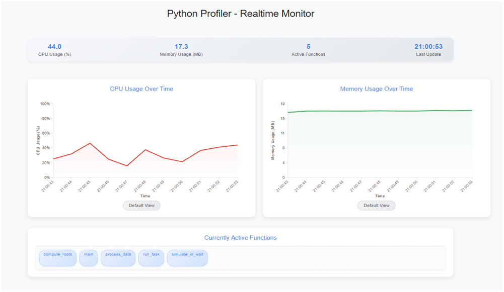

# 🔬 PyLens

**PyLens** is a unified Python performance and complexity analysis suite built as a set of three powerful developer tools. It is designed for **Visual Studio Code Extension**.

---

## 🚀 Features

### 1. **Python Profiler (VSCode Extension)**
- Real-time CPU & memory usage tracking
- Displays active functions during execution

- Post-execution panel with:
  - Avg. CPU usage per function
  - Avg. memory usage per function
  - Number of calls
  - Total time and cumulative stats
  
  
  
  

### 2. **Profiler Notebook (Jupyter Extension)**
- Statement-level timing and CPU usage
- Per-cell summary:
  - Total time
  - Number of operations (hits)
  - Performance classification (Performance-critical, CPU-intensive, Loop-intensive, Memory-intensive)
  
  

### 3. **Python Complexity Checker**
- Project-wide maintainability and reusability scores
- Carbon footprint estimate

- Interactive tree of classes/functions

- Highlights code issues (e.g., too many parameters, deep nesting)

- File-based view with maintainability index and issues per file


---

## 💻 Supported OS

✅ **Windows 11**  

---

## ⚙️ Installation Instructions

### 1. **Clone the Repository**

```bash
git clone https://github.com/Bharadwaj-07/PyLens.git
cd PyLens
```
### 2. **Install Dependencies**
pip install -r Requirements.txt [ Run this command to install required dependencies ] pip3 install -r Requirements.txt

### 3. **Launch PyLens Extensions (VSCode)**
- Open python complexity folder in vs code editor window 
- Press F5 [ Enviornment/Developer Window will open ] 
- Press ctrl + shift + p [ Command pallette will get open ] 
- Select command [ Show python profiler / Profile notebook /Run python complexity checker ]


## Team Contributions
- **Pashaula Eswar Sai [ CS24M109 ]**: Designed and developed the Python Profiler extension, including the real-time dashboard and post-execution function report
- **M Yashwanth Kumar [ CS24M122 ]**: Developed the Profiler Notebook extension, worked on inline metrics capture and cell classification logic. Integrated Profiler extension with Notebook and with Complexity Checker.
- **Gooty Bharadwaj [ CS24M123 ]**: Built the Python Complexity Checker, implemented maintainability index calculations, UI structure, and issue detector logic for large-scale codebases

## Testing
- For testing the features of the tool use "testing" folder.
